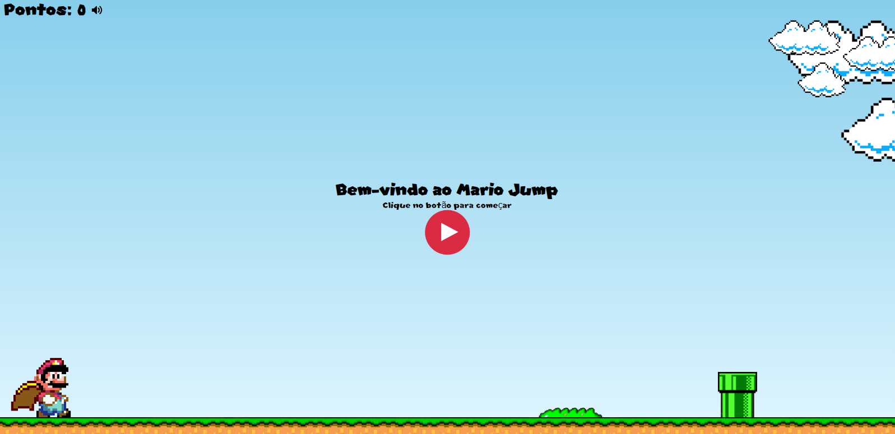

<h1 align="center">
🚀 Mario Jump
</h1>

  
  
  

## 📫 Visualização do projeto

## 💻 Projeto
O projeto foi inspirado no "joguinho do dinossauro" do chrome e adaptado para o Mario, 

## 🤝 Como executar

- Clone o repositório
- Instale o `live server` no seu editor de código

## 📫 Contribuindo para o Portfólio

Para contribuir com o Portfólio, siga estas etapas:

1. Bifurque este repositório.
2. Crie um branch: `git checkout -b <nome_branch>`.
3. Faça suas alterações e confirme-as: `git commit -m '<mensagem_commit>'`
4. Envie para o branch original: `git push origin <nome_do_projeto> / <local>`
5. Crie a solicitação de pull.

Como alternativa, consulte a documentação do GitHub em [como criar uma solicitação pull](https://help.github.com/en/github/collaborating-with-issues-and-pull-requests/creating-a-pull-request).

## 📜 Licença

Esse projeto está sob a licença MIT. Veja o arquivo [LICENSE](/LICENSE) para mais detalhes.

---
